# Antidebug Golang Binary (not spurious) on Windoze


This project is also available at [acmpxyz.com/go_antidebug.html](https://acmpxyz.com/go_antidebug.html).

Debugging Golang binaries could be strange, they may be PE or ELF binaries and it is a fairly new language. In this case, the binary has an antidebug user-mode function so we are going to debug it. There are cool features (that you should read in [Analyzing Golang Executables](https://www.pnfsoftware.com/blog/analyzing-golang-executables#title_basics)) about Go programming language but there is not main purpose... However, why is Golang used for malware development? I am not an expertise on it but my opinion is:

- **Concurrency** (via [goroutines](https://gobyexample.com/goroutines)) can provide us an easy way to build state graph about our infected endpoint (if we act as *C2* operator). Therefore, we will be able to control more easily from a single binary. I do not
know if concurrency could fix in dropper or agent; instead, parallelism (in
my view) is a good feature on dropper or agent in order to decrease
early detection. For instance, you can simulate many trivial events and cover up few illegitimate events. It is a good discussion. An useful talk about concurrency and parallelism is [Rob Pike's talk](https://blog.golang.org/waza-talk).

- **Statically linked** help us to develop malware not dependent on libraries and versioning. However, this feature could be a disadvantage if we implement a dropper or agent because due to its large size. Note that distribution has to be lightweight. Golang executables have *runtime* functions and they need debug symbols. However, these binaries can be stripped but do not hide much information. If you want to stripped it, check this great post [Shrink your Go binaries with this one weird trick](https://blog.filippo.io/shrink-your-go-binaries-with-this-one-weird-trick/).

- **Cross-compiling** is a built-in feature in Golang toolchain. Therefore we can compile a lot of architectures. Despite this, we need to take care with some imports via *syscall* library because antidebug functions are often dependent on the operating system (``syscall.SYS_PTRACE`` vs ``syscall.NewLazyDLL("kernel32.dll").NewProc("IsDebuggerPresent")``). See the following command to check different architectures.

```bash
$ go tool dist list
aix/ppc64
android/386
android/amd64
android/arm
android/arm64
darwin/386
darwin/amd64
darwin/arm
darwin/arm64
dragonfly/amd64
freebsd/386
freebsd/amd64
freebsd/arm
freebsd/arm64
illumos/amd64
js/wasm
linux/386
<brrr many more>
...
```

- **Simplicity of syscalls** makes it easy for us kernel land communication in order to get or modify system attributes. It allows us to use [Windows API](https://medium.com/@justen.walker/breaking-all-the-rules-using-go-to-call-windows-api-2cbfd8c79724) or [Linux API](https://golang.org/pkg/syscall/).


## main-antidebug.exe

Binary executes a trivial function (*XOR bitwise*) that decrypts (or encrypts) an URL. That functionality could be use in order to ofuscate a *C2* server but it is being shown as example. Before that, there is an antidebug function so it makes our task less straightforward. It is worth mentioning that binary does not contain any infectious action. Furthermore, it is not stripped so feel free in order to reverse it :) 

- [main-antidebug.exe](bin/main-antidebug.exe) 

```bash
$ md5sum main-antidebug.exe
46bd84fbc164eed7e7bae4db49a48a49  main-antidebug.exe
$ sha256sum main-antidebug.exe
0afe7690843b5a74db20ca805f5d7659960f9b4e3dd0334ad2c800e4db75e3c7  main-antidebug.exe
```

- [PE-bear](https://hshrzd.wordpress.com/PE-bear/)
- [IDA Freeware](https://www.hex-rays.com/PRoducts/ida/support/download_freeware/) (not *IDA Chinese backdoor Pro Version*)
- [x64dbg](https://x64dbg.com/#start)


### PE-bear static analysis

It is time to perform a trivial static analysis with *PE-bear*. If you want to know about PE format, please, check [Micro$oft specification](https://docs.microsoft.com/en-us/windows/win32/debug/pe-format). In the following screenshot we can see some specific characteristics from *File Header*.

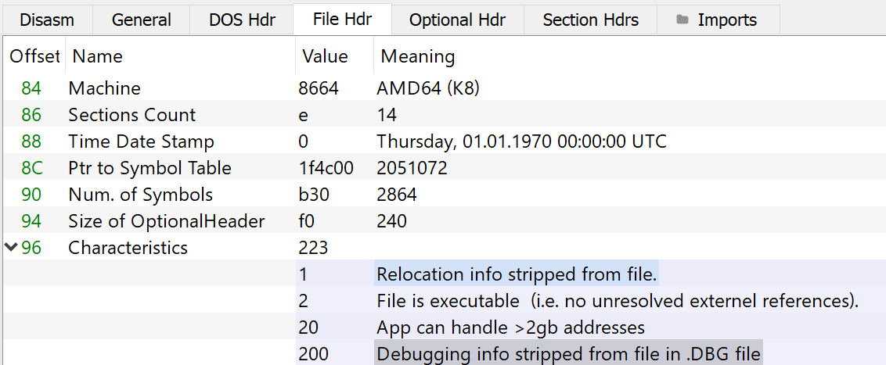

- *Relocation info stripped from file* ``IMAGE_FILE_RELOCS_STRIPPED 0x0001``. In this case *image base field* is ``0x400000`` as we can be seen in *optional header*.
*Image only, Windows CE, and Microsoft Windows NT and later. This indicates that the file does not contain base relocations and must therefore be loaded at its preferred base address. If the base address is not available, the loader reports an error. The default behavior of the linker is to strip base relocations from executable (EXE) files.*

- *File is executable (i.e no unresolved external references) ``IMAGE_FILE_EXECUTABLE_IMAGE 0x0002``*. Okay.
*Image only. This indicates that the image file is valid and can be run. If this flag is not set, it indicates a linker error.*

- *App can handle >2gb addresses* ``IMAGE_FILE_LARGE_ADDRESS_ AWARE 0x020``. Okay ()
*Application can handle > 2-GB addresses.* **OKAY**.

- *Debugging info stripped from file in .DBG file* `` IMAGE_FILE_DEBUG_STRIPPED  0x0200``. Okey, it makes sense... Binary is not stripped but it has not compiled with debug symbols.
*Debugging information is removed from the image file.* 

At least it tells us that it is not a DLL or removable media! We are going to analyz *Optional Header* :).

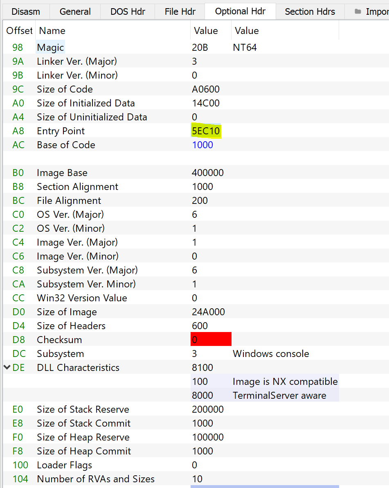

We are seeing outstanding features:

- *Magic Number* is ``0x20B`` so it indicates that binary runs on 64-bit address space (PE32+ format).

- *Entry Point* is ``0x5EC10`` offset.

- *Image Base* is ``0x400000`` but it does not matter. It is use for technical details, you should read [Why is 0x00400000 the default base address for an executable?](https://devblogs.microsoft.com/oldnewthing/20141003-00/?p=43923)

- *Size of Stack Reserve and Commit* specify total *stack* allocation in virtual memory and total amount of physical memory to allocate at a time respectively.

- *Size of Heap Reserve and Commit*  specify total *heap* allocation in virtual memory and  the amount of physical memory to allocate at a time respectively.

Okay, we know a little more about *Optional Header*. Maybe, [*DLL Characteristics*](https://docs.microsoft.com/en-us/windows/win32/debug/pe-format#characteristics) is a good field to learn about *DLL* image but we will not waste time (**RTFM**). Final step (before disassembly and debugging) could be *Section Headers*.

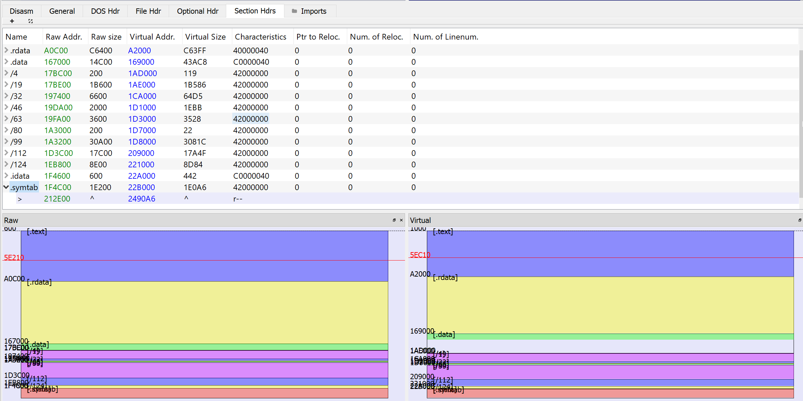

As we can see there are [common sections](https://blog.kowalczyk.info/articles/pefileformat.html) (``.text``, ``.rdata``, ``.data``, ``.idata`` and ``.symtab``). Note that ``.text`` section has more raw size than its virtual size therefore is a good indicator that binary is not packed. Furthermore, there are inconsistent sections that I do not understand; ``/4 /19 /32 /46 /63...``. When this occurs I usually use another static analyzer as [pestudio](https://www.winitor.com/) to perform double check ;) 

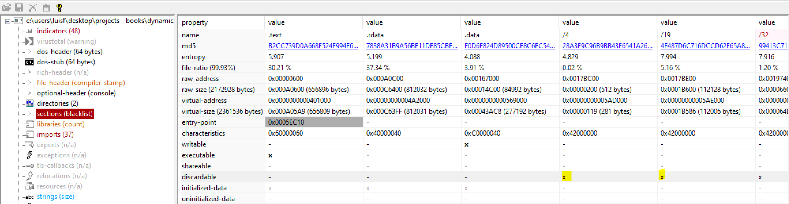

In this case, sections are equals but they are *discardable*. In user-mode this flag of discardable and non-discardable memory is not necessary because the memory manager performs the task. However, we are unaware that binary has code that is executed in user or kernel mode. A quick look at [What happens when you mark a section as DISCARDABLE?](https://devblogs.microsoft.com/oldnewthing/20120712-00/?p=7143) could be useful in order to understand this flag. In my view, these sections could be runtime initialization variables (code cannot be because they are not marked as executable). Perhaps *IDA* will give us more clues.

### IDA disassembly

*IDA* is good choice for disassembling code and attaching a debugger. In this case we are going to search section and function names. Back to rare sections, we can see that *IDA* contains the following:

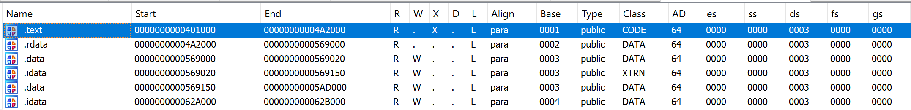

In the above screenshot we see six sections: ``.text``, ``.rdata``, ``.data``, ``.idata``, ``.data`` and ``.idata``. If we compare *virtual-address* (these values are based on *Image Base* value of PE binary ``0x400000``, it is not really a virtual address...), rare sections after ``.data`` section ``0x5AD000``. As we can see *IDA* does not detect them. 

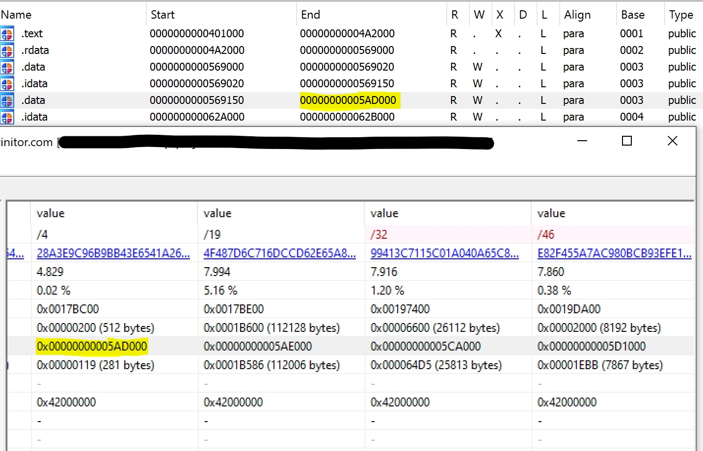

In this case we check after ``0x5AD000`` to see if we can find something.

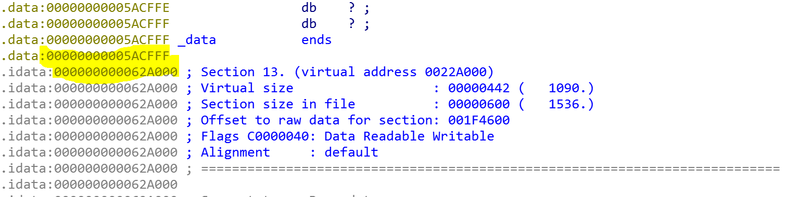

Okay, there is nothing. If you know what these sections are, please contact me via Twitter! [@lfm3773](https://twitter.com/lfm3773). After this little research, we will focus on other stuff.

For instance, at a glance functions are useful. We can see a lot of ``runtime_*`` and ``type_*`` functions because is statically-linked. But as we can see there are relevant functions; ``syscall___LazyDLL__Load``, ``syscall____LazyDLL__NewProc``, ``syscall_NewLazyDLL``. It appears that there are functions that are not statically-linked. Check [Golang documentation about *LazyDLL*](https://golang.org/pkg/syscall/?GOOS=windows#LazyDLL).

*A LazyDLL implements access to a single DLL. It will delay the load of the DLL until the first call to its Handle method or to one of its LazyProc's Addr method. LazyDLL is subject to the same DLL preloading attacks as documented on LoadDLL.*

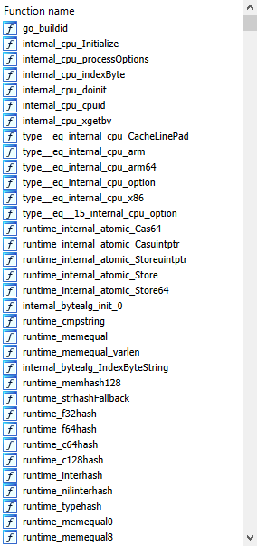
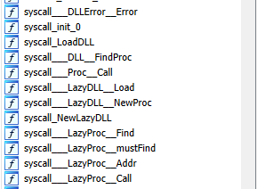

But if we search by ``main`` string... Oops! There is a ``main_main`` function and ``main_encryptUrl`` also seems important.

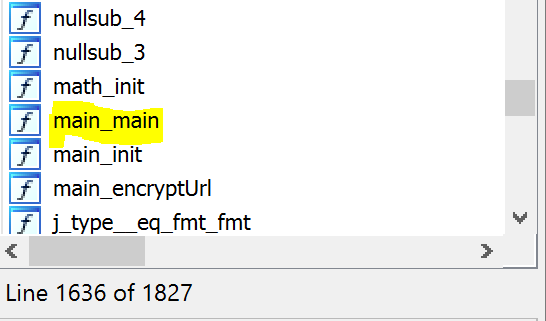

So we have found the main program! Furthermore, as we can see below, antidebug function is ``main_ProcIsDebuggerPresent`` which belongs to ``kernel32.dll``. According to [offical documentation](https://docs.microsoft.com/en-us/windows/win32/api/debugapi/nf-debugapi-isdebuggerpresent) it *determines whether the calling process is being debugged by a user-mode debugger.*

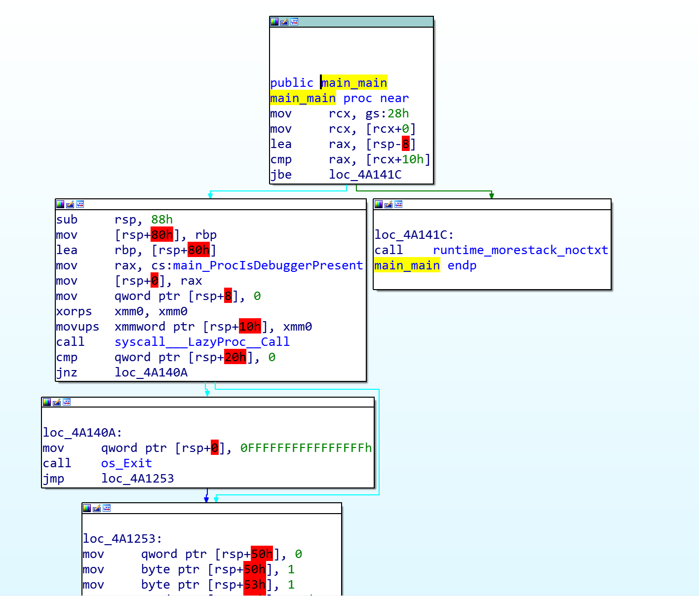

It is time to save the pseudo-*virtual addresses* because we will need them on debugging process. As we can see on second screenshot, ``rax`` register is passed as an argument and it contains a *code segment* that will contain ``IsDebuggerPresent`` function. More details in [``src/syscall/dll_windows.go`` documentation](https://golang.org/src/syscall/dll_windows.go?s=10248:10317#L325)

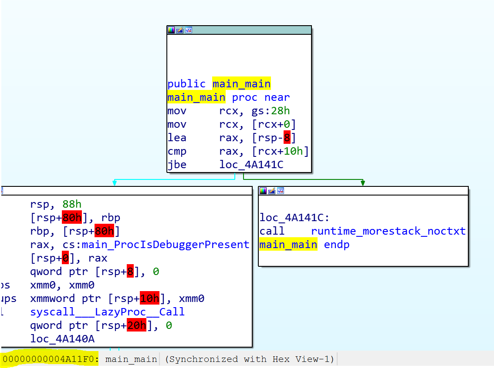
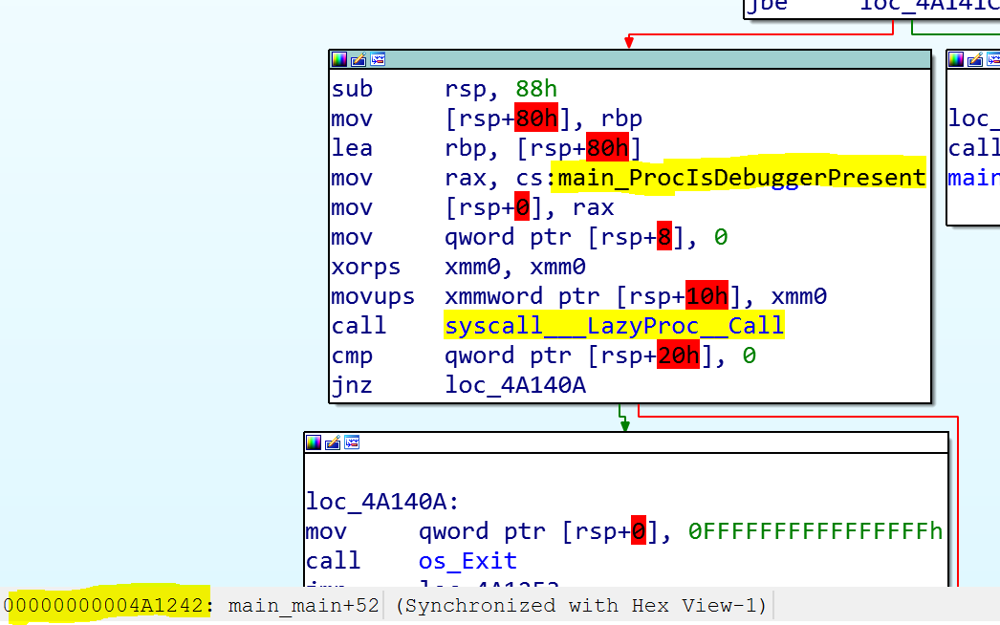
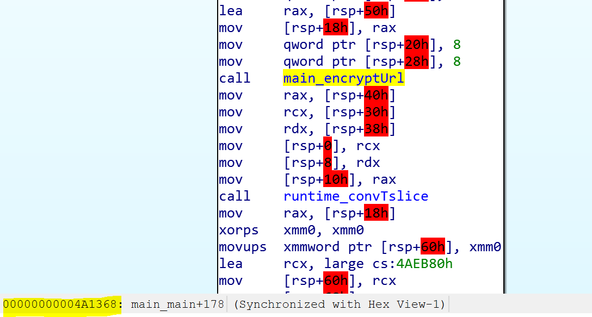

- ``main_main`` with ``0x4A11F0``
- ``syscall___LazyProc__Call`` with ``0x4A1242``
- ``main_encryptUrl`` with ``0x4A1368``

### x64dbg debugging 

Finally, we are going to set breakpoints at key locations; ``0x4A11F0``, ``0x4A1242``+5 (after function call, at ``cmp`` instruction) and ``0x4A1368``.

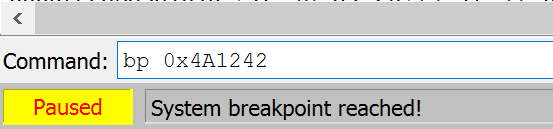

Once breakpoints have been placed, we run the debugger and we will see the following:

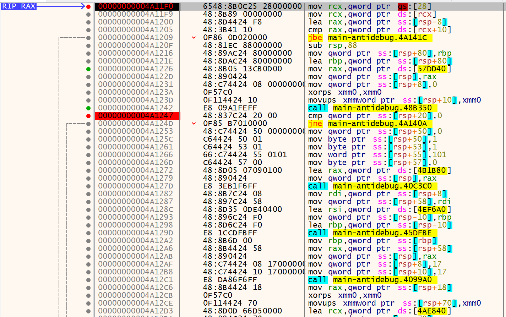

Then, main goal of post is to bypass antidebug function, therefore we need to change ``stack`` return value of ``IsDebuggerPresent`` function. In this case, binary runs a ``cmp qword ptr ss:[rsp+20],0`` so okay:

1. ``rsp`` is ``0x000000C0000CBEF8`` + ``0x20`` = ``0x000000C0000CBF18``.
2. ``0x000000C0000CBF18`` has value ``1``.
3. We must change it.

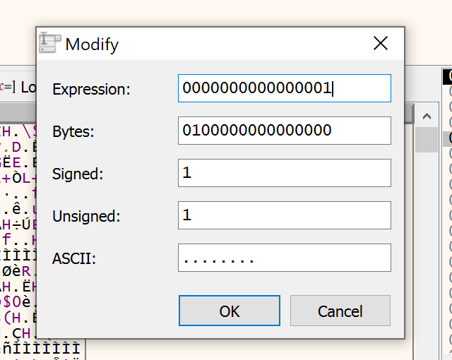
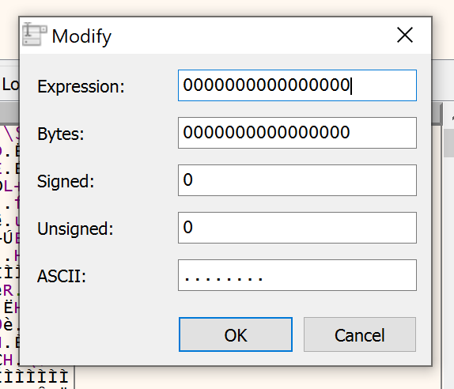
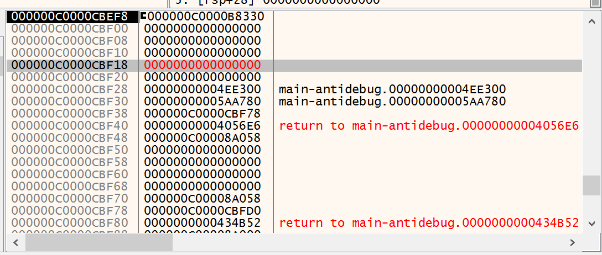

We run the debugger and we will bypass antidebug function. Finally, last breakpoint has been reached. It is worth noting that we have set another point to see the function result. 

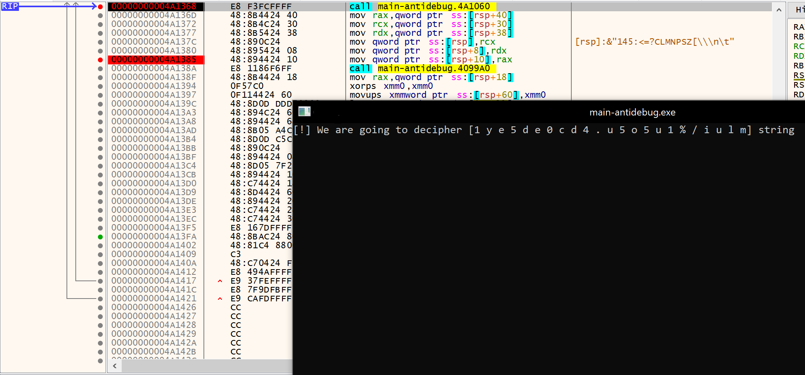

Let's move on to the next breakpoint and we have found the decoded character string ``0xd4ed1be5/t4n4t0$.html``

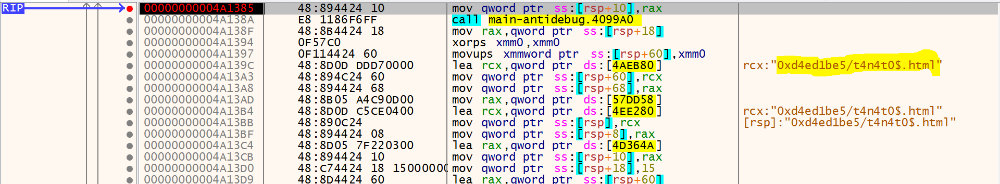

If we write this string on our browser as ``https://0xd4ed1be5/t4n4t0$.html``, we obtain the following:

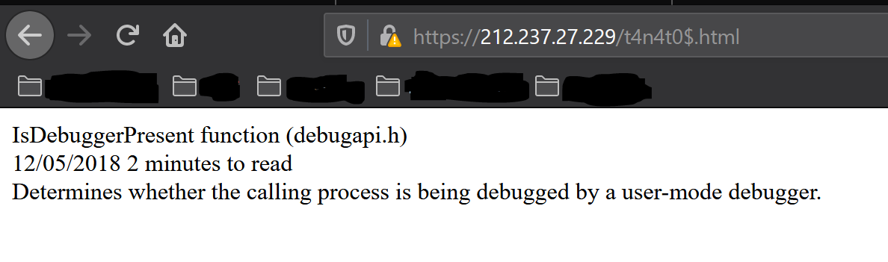

As we can see URL could be build with hexadecimal characters due to [RFC 1738 - Uniform Resource Locator](https://tools.ietf.org/html/rfc1738). Code has been implemented by me and it has been used for a CTF challenge. Note that this challenge did not include antidebug function. Finally, code is shown below. 

<pre><code class="language-go">
/*
Author: Luis Fueris
Date: January 24, 2021
Description: this sample code shows a function that encrypt/decrypt (please,
erase comments if you want to do cipher operation) an URL dynamically. It 
could be use to hide a C2 URL from static analysis

*/
package main

import (
    "fmt"
    "os"
    "syscall"
)

// Windows DLL definitions. Note that these DLL could be define in another
// file (winmods for instance)
var (
    ModKernel32 = syscall.NewLazyDLL("kernel32.dll")
    ProcIsDebuggerPresent = ModKernel32.NewProc("IsDebuggerPresent")
)

// URL length
var LEN = 23


// Implements XOR bitwise operation to URL string
//
func encryptUrl(url []string, key []byte) []byte {
    bLetter := make([]byte, 1)
    cipherLetter := make([]byte, 1)
    cipherUrl := make([]byte, LEN)

    for i, letter := range url {
        bLetter = []byte(letter)
        for j, bit := range bLetter {
            cipherLetter[j] = bit ^ key[j]
        }

        cipherUrl[i] = cipherLetter[0]
    }

    return cipherUrl
}

// Main program checks is a debugger is present and calls cipherUrl() function
// in order to decrypt malicious URL. It should be noted that XOR cipher uses
// same function to encrypt and decrypt so if you want to encrypt something, 
// please erase comments (oUrl var) and call encryptUrl() 
//
func main() {

    flag, _, _ := ProcIsDebuggerPresent.Call()
    if flag != 0 {
        os.Exit(-1)
    }

    key := []byte{1, 0, 0, 1, 0, 1, 1, 0}
    //oUrl := []string{"0", "x", "d", "4", "e", "d", "1", "b", "e", "5","/", 
    //                            "t", "4", "n", "4", "t", "0", "$",".", "h",
    //                            "t", "m", "l"}
    cUrl := []string{ "1", "y", "e", "5", "d", "e", "0", "c", "d", "4", ".", 
                                  "u", "5", "o", "5", "u", "1", "%", "/", "i", 
                                  "u", "l", "m"}
    //fmt.Printf("[!] We are going to cipher %s string\n", oUrl)
    //cUrl := encryptUrl(oUrl, key)
    //fmt.Printf("[*] Cipher URL: %s\n", cUrl)

    fmt.Printf("[!] We are going to decipher %s string\n", cUrl)
    dUrl := encryptUrl(cUrl, key)
    fmt.Printf("[*] Decipher URL: %s\n", dUrl)

    return 
}
</code></pre>


## References

1. [ Pnfsoftware - ANALYZING GOLANG EXECUTABLES - GOLANG BAsics for Reverse Engineers](https://www.pnfsoftware.com/blog/analyzing-golang-executables/)

2. [Medium - BREAKING ALL THE RULES: USING GO TO CALL Windows API](https://medium.com/@justen.walker/breaking-all-the-rules-using-go-to-call-windows-api-2cbfd8c79724)

3. [Microsoft Documentation - PE Format](https://docs.microsoft.com/en-us/windows/win32/debug/pe-format)

4. [Microsoft Documentation - /STACK (Stack Allocations)](https://docs.microsoft.com/en-us/cpp/build/reference/stack-stack-allocations?view=msvc-160)

5. [Microsoft Documentation - /HEAP (Set Heap Size)](https://docs.microsoft.com/en-us/cpp/build/reference/heap-set-heap-size?view=msvc-160)

6. [Devblogs Microsoft - What happens when you mark a section as DISCARDABLE?](https://devblogs.microsoft.com/oldnewthing/20120712-00/?p=7143)

7. [StackOverflow - ELF binary analysis static vs dynamic. How does assembly code| instruction memory mapping changes?](https://stackoverflow.com/questions/54295129/elf-binary-analysis-static-vs-dynamic-how-does-assembly-code-instruction-memor)

8. [Windows Documentation - IsDebuggerPresent function (debugapi.h](https://docs.microsoft.com/en-us/windows/win32/api/debugapi/nf-debugapi-isdebuggerpresent)